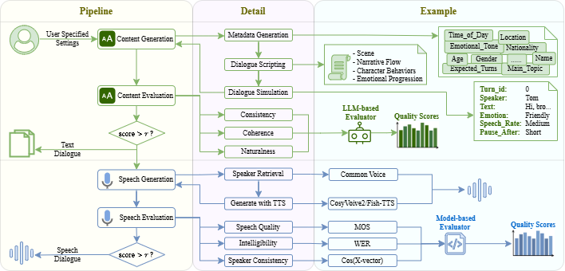

# SpeechDialogueFactory: Generating High-Quality Speech Dialogue Data to Accelerate Your Speech-LLM Development

A comprehensive framework for generating high-quality speech dialogues at scale to support Speech-LLM development and evaluation.

## Overview



SpeechDialogueFactory addresses critical challenges in creating speech dialogue datasets by offering:

- **High-quality dialogue generation** through a structured three-stage pipeline
- **Natural speech synthesis** with paralinguistic features and emotion awareness
- **Comprehensive quality control** for both content and speech output
- **Efficient implementation** for both interactive exploration and batch production

## Key Features

- **Multi-Stage Content Generation** `src/generator/content/`
  - Metadata generation with fine-grained dialogue parameter control 
  - Dialogue scripting for improved narrative coherence 
  - Dialogue simulation with paralinguistic annotations 

- **Expressive Speech Synthesis** `src/generator/speech/`
  - Speaker voice retrieval from diverse voice banks
  - Advanced TTS with emotional expression and speech rate control
  - Natural turn-taking dynamics with appropriate pause durations

- **Quality Assessment Framework** `src/evaluator/<content|speech>/`
  - Content evaluation across consistency, coherence, and naturalness dimensions
  - Speech quality checking for naturalness, intelligibility, and speaker consistency

- **Flexible Implementation**
  - Interactive web UI for detailed exploration and visualization
  - Command-line interface for large-scale batch processing
  - Parallel processing for improved generation speed

## Datasets

We provide sample datasets in both [English](https://huggingface.co/datasets/minghanw/sdf_dataset_en) and [Chinese](https://huggingface.co/datasets/minghanw/sdf_dataset_zh), featuring:
- 3,000+ dialogues in each language
- Diverse topics, emotions, and speaker demographics

## Installation

1. Clone the repository
```bash
git clone --recursive https://github.com/yuriak/SpeechDialogueFactory.git
cd SpeechDialogueFactory
```

2. Install the required dependencies
```bash
pip install -r requirements.txt
```

3. Install third-party dependencies
```bash
cd third_parties/CosyVoice2/ && pip install -e . && cd -
cd third_parties/F5-TTS/ && pip install -e . && cd -
cd third_parties/UTMOSv2/ && pip install -e . && cd -
```

4. Download pretrained models
- Put pretrained `CosyVoice2-0.5B` into `./third_parties/CosyVoice/pretrained_models/CosyVoice2-0.5B`
- Other pretrained models are automatically downloaded when running the system

5. Get [CommonVoice dataset](https://commonvoice.mozilla.org/en/datasets) (any version for English and Chinese) as voice bank
- Put the downloaded dataset into `./commonvoice/cv-corpus-<version>-<date>`


## Configuration

We prepared the configuration template in the `configs/` directory. You can modify the parameters according to your needs. Web UI and batch generation will use different config files, named as `config_app.json` and `config_batch.json`, respectively.

The config file is structured as follows:
```json
{
    "sdf_args":{
        "tts_in_use": "CosyVoiceTTS", // TTS module to use
        "lazy_load": true // whether to lazy load all modules
    },
    "module_args": {
        "LLM": {
            "llm_in_use": "meta-llama/Llama-3.3-70B-Instruct",
            "inference_mode": "vllm", // inference mode for LLM [vllm|api|azure]
            "api_key": "",
            "base_url": "",
            "fast_mode": true // fast mode is for json guided generation, i.e. run with un-guided first, then run guided on invalidated samples
        },
        "ScenarioGenerator": {
            "default_language": "English"
        },
        "ContentQualityFilter": {
            "consistency_threshold": 0.85,
            "coherence_threshold": 0.85,
            "naturalness_threshold": 0.85
        },
        "CosyVoiceTTS": {
            "cosyvoice_codebase": "./third_parties/CosyVoice",
            "cosyvoice_model_checkpoint": "./third_parties/CosyVoice/pretrained_models/CosyVoice2-0.5B",
            "cosyvoice_voice_bank_path": "./commonvoice/cv-corpus-20.0-delta-2024-12-06/en/",
            "cosyvoice_device": "cuda:0",
            "target_sample_rate": 16000,
            "num_tts_workers": 4, // number of process workers for TTS
            "cosyvoice_tmp_dir": "./tts_tmp"
        },
        "IntelligibilityEvaluator": {
            "whisper_model_name": "turbo",
            "whisper_device": "cuda:0",
            "whisper_input_sr": 16000,
            "num_whisper_workers": 4, // number of process workers for ASR
            "intelligibility_evaluation_temp_dir": "./asr_tmp"
        },
        "SpeechQualityEvaluator": {
            "model_path": "./third_parties/UTMOSv2/models/fusion_stage3/fold0_s42_best_model.pth",
            "input_sr": 16000,
            "mos_tmp_dir": "./mos_tmp", // temporary directory for UTMOSv2
            "num_workers": 4, // number of dataloader workers in UTMOSv2
            "batch_size": 32,
            "mos_device": "cuda:0",
            "num_mos_workers": 4, // number of process workers for MOS
            "speech_quality_evaluation_temp_dir": "./squality_tmp" // temporary directory for speech quality evaluation (used for inter-process communication)
        },
        "SpeakerConsistencyEvaluator": {
            "speaker_consistency_model_dir": "./third_parties/pretrained_models/spkrec-xvect-voxceleb",
            "speaker_consistency_device": "cuda:0",
            "input_sr": 16000,
            "speaker_consistency_threshold": 0.94
        },
        "SpeechQualityFilter":{
            "intelligibility_threshold": 0.8,
            "speaker_consistency_threshold": 0.9,
            "speech_quality_threshold": 0.6
        }
    }
}
```

## Quick Start

```
# Run Web UI for interactive exploration
bash scripts/run_app.sh

# Run command line for batch generation
bash scripts/run_batch.sh \
 -c <CONFIG_FILE> \
 -o <OUTPUT_DIR> \
 -i <INPUT_PROMPT_FILE> \
 -n <NUM_DIALOGUES_PER_PROMPT> \
 -l <LANGUAGE>
```

## Citation

If you use SpeechDialogueFactory in your research, please cite our paper:

```

```